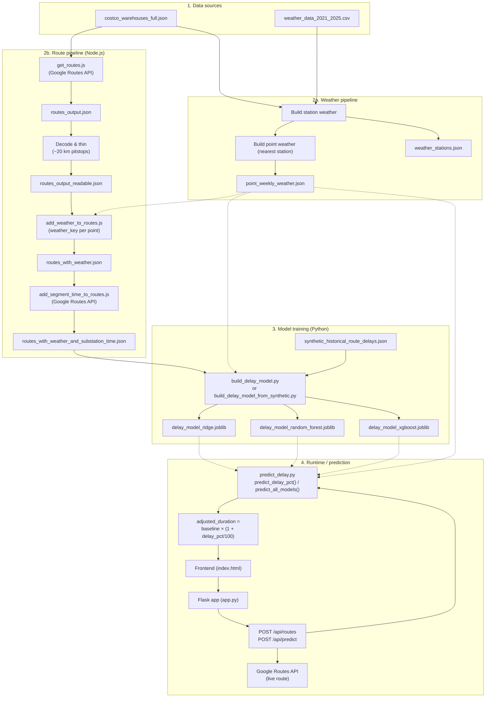

# Prompt: Create a Descriptive Flowchart for Costco Route & Weather Delay Forecasting

Use this prompt with a flowchart tool (Mermaid, draw.io, Lucidchart, or an AI image generator) to produce a clear methodology flowchart.

---

## Instructions for the flowchart

Create a **descriptive flowchart** that shows the full methodology of the Costco Route & Weather Delay Forecasting project. Use distinct swimlanes or sections for: **(1) Data preparation**, **(2) Route pipeline**, **(3) Weather pipeline**, **(4) Model training**, and **(5) Runtime / prediction**. Show inputs, outputs, and file names where useful. Use arrows to indicate flow and optional dashed lines for “uses” or “reads from.” Keep labels short but precise.

---

## Methodology to depict

### High-level goal
Predict **weather-based delay %** for delivery routes from a depot (Tracy, CA) to Costco warehouses. Three ML models (Ridge, Random Forest, XGBoost) predict delay % from segment-level weather; **adjusted_duration = baseline_duration × (1 + delay_pct / 100)**.

---

### 1. Data preparation (sources)
- **Inputs:**  
  - `costco_warehouses_full.json` (warehouse id, name, lat, lng).  
  - `weather_data_2021_2025.csv` (daily weather by station, 2021–2025).  
- **Process:** Build weather indexes and station lists (e.g. `build_station_daily_weather.js` → `station_daily_weather.jsonl`; then build point-level weather from nearest station).  
- **Outputs:**  
  - `weather_stations.json` (station id, lat, lng, name).  
  - `station_weekly_weather.json` (52-week averages per station).  
  - `point_weekly_weather.json` (weekly weather per unique point key, e.g. rounded lat_lng).  
  - Optionally `point_daily_weather.json` for daily history.  

Show: **Source data** → **Build station weather** → **Build point weather (nearest station)** → **point_weekly_weather.json** (and related files).

---

### 2. Route pipeline (Node.js, run in order)
- **Step 2a – Get routes**  
  - **Input:** Depot (Tracy) + `costco_warehouses_full.json`.  
  - **Process:** `get_routes.js` calls **Google Routes API** (Directions v2) for each warehouse; up to 3 alternative routes per destination; returns encoded polylines, distance, duration.  
  - **Output:** `routes_output.json` (raw API response with polylines).  

- **Step 2b – Decode and thin to ~20 km segments**  
  - **Input:** `routes_output.json`.  
  - **Process:** Decode polylines; thin path to points ~20 km apart (“pitstops”).  
  - **Output:** `routes_output_readable.json` (path as sequence of lat/lng points per route).  

- **Step 2c – Add weather key per point**  
  - **Input:** `routes_output_readable.json`, `weather_stations.json`, station weekly weather, optional `point_weather_cache.json`.  
  - **Process:** For each path point, find **nearest weather station**; assign `weather_key` (e.g. rounded lat_lng); optionally run `slim_routes_weather.js` to keep only lat, lng, weather_key (no inline weather).  
  - **Output:** `routes_with_weather.json` (each point has lat, lng, weather_key).  

- **Step 2d – Add segment distance and time**  
  - **Input:** `routes_with_weather.json`.  
  - **Process:** `add_segment_time_to_routes.js` calls **Google Routes API** for each consecutive pair of pitstops (A→B); get distance and duration; use segment cache to avoid duplicate calls.  
  - **Output:** `routes_with_weather_and_substation_time.json` (each point has weather_key, distance_to_next_km, duration_to_next_min).  

Show: **Depot + Warehouses** → **get_routes.js** → **routes_output.json** → **Decode & thin** → **routes_output_readable.json** → **add_weather_to_routes.js** → **routes_with_weather.json** → **add_segment_time_to_routes.js** → **routes_with_weather_and_substation_time.json**.

---

### 3. Model training (Python)
- **Option A – From route + weather files**  
  - **Inputs:** `routes_with_weather_and_substation_time.json`, `point_weekly_weather.json`.  
  - **Process:** For each segment, look up weather by weather_key; aggregate 52-week stats to features (temp, snow, precipitation, visibility, wind, etc.); define a **synthetic delay %** target from weather severity; train/test split; fit Ridge, Random Forest, XGBoost.  
  - **Script:** `build_delay_model.py`.  

- **Option B – From synthetic historical delays**  
  - **Input:** `synthetic_historical_route_delays.json` (precomputed records with weather + delay_pct).  
  - **Process:** Train on 80%, hold out 20%; same three models; same feature set (weather + journey_start_hour, day_of_week, month, week_of_year).  
  - **Script:** `build_delay_model_from_synthetic.py`.  

- **Outputs (both options):**  
  - `delay_model_ridge.joblib`  
  - `delay_model_random_forest.joblib`  
  - `delay_model_xgboost.joblib`  
  (Each artifact: model + scaler + feature_names.)

Show: **Route+weather JSON** or **synthetic_historical_route_delays.json** → **Build delay model script** → **Train/validation split** → **Ridge / Random Forest / XGBoost** → **Three .joblib files**.

---

### 4. Runtime / prediction (API and frontend)
- **Backend (Flask):**  
  - Serves frontend (static files from `frontend/`).  
  - **Endpoints:** GET warehouses, source, config; POST `/api/routes` (get routes from Google + segment pitstops + weather); POST `/api/predict` (predict delay % per route using loaded .joblib models).  
  - **Flow:** User picks source (Tracy) and destination (warehouse) → backend fetches route from Google → samples pitstops ~20 miles apart → for each pitstop gets weather (from point_weekly_weather or live lookup) → aggregates weather to feature vector → `predict_delay_pct(weather_dict, model_name)` or `predict_all_models(weather_dict)` → returns delay % per model → **adjusted_duration = baseline_duration × (1 + delay_pct / 100)**.  

- **Frontend:**  
  - UI to select warehouse; “Get routes & predict delay”; displays route options, baseline duration, delay % (Ridge, RF, XGBoost), adjusted duration; optional map.  

Show: **User** → **Frontend** → **Flask app** → **GET/POST APIs** → **Google Routes API** (for live route) → **Load .joblib models** + **Look up weather** → **Predict delay %** → **Return adjusted duration** → **Display in UI**.

---

### 5. Key features and formulas
- **Segment length:** ~20 km (≈20 mile) pitstops along each route.  
- **Weather:** Nearest weather station per point; 52-week aggregated features (temp, snow, prcp, visibility, wind, etc.) plus optional time-of-year (hour, day_of_week, month, week_of_year).  
- **Target:** Delay % (relative to baseline).  
- **Formula:** `adjusted_duration = baseline_duration × (1 + delay_pct / 100)`.

---

## Suggested flowchart structure (summary)

1. **Data preparation:** Source files → build station/point weather → `point_weekly_weather.json`, `weather_stations.json`.  
2. **Route pipeline:** Depot + warehouses → get_routes → decode/thin → add weather_key → add segment time → `routes_with_weather_and_substation_time.json`.  
3. **Model training:** Route+weather or synthetic JSON → build_delay_model (A or B) → Ridge, RF, XGBoost → three .joblib files.  
4. **Runtime:** User → Frontend → Flask → APIs → Google Routes (live) + weather lookup + predict_delay → adjusted duration → UI.

Include a short legend if needed: solid arrows = data flow; dashed = “uses” or “reads from”; label key files in rounded rectangles and processes in rectangles.

---

## Ready-to-use Mermaid flowchart

Paste the block below into [Mermaid Live](https://mermaid.live/) or any Markdown renderer that supports Mermaid to get a descriptive flowchart.

